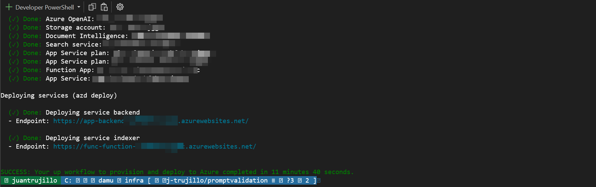

# Deployment 
This project supports `azd` for easy deployment of the complete application, as defined in the main.bicep resources. 

## Complete Main Deployment
Use `azd` to deploy the main resources. This requires the [Azure Developer CLI](https://learn.microsoft.com/en-us/azure/developer/azure-developer-cli/install-azd?tabs=winget-windows%2Cbrew-mac%2Cscript-linux&pivots=os-windows) to be installed on your machine. 

### Deploying from scratch

Execute the following command, if you don't have any pre-existing Azure services and want to start from a fresh deployment.

1. Run `azd up` - This will provision Azure resources and deploy this sample to those resources.
   - For the target location, see an up-to-date list of regions and models [here](https://learn.microsoft.com/azure/cognitive-services/openai/concepts/models)
   - If you have access to multiple Azure subscriptions, you will be prompted to select the subscription you want to use. If you only have access to one subscription, it will be selected automatically.

   > [!NOTE] 
   > This application uses the `gpt-4o` model. When choosing which region to deploy to, make sure the desired model is available in that region (i.e. EastUS). For more information, see the [Azure OpenAI Service documentation](https://learn.microsoft.com/azure/cognitive-services/openai/concepts/models).  
   > This application also requires a preview version of Document Intelligence, which at the time of publishing this project is only available in EastUS, WestUS2 or WestEurope regions. Document processing will not work if deployed in a region without this preview support. See [documentation](https://learn.microsoft.com/en-us/azure/ai-services/document-intelligence/overview?view=doc-intel-4.0.0) to check preview status and availability.

1. After the application has been successfully deployed you will see two URLs printed to the console, one for the Function (document processing), and one for the app. Click the URL for the `service backend` to interact with the application in your browser.

It will look like the following:

> [!NOTE] 
> It may take several minutes for the application to be fully deployed.

### Use existing resources

If you have existing resources in Azure that you wish to use, you can configure `azd` to use those by setting the following `azd` environment variables:

1. Run `azd env set AZURE_OPENAI_SERVICE {Name of existing OpenAI service}`
1. Run `azd env set AZURE_OPENAI_RESOURCE_GROUP {Name of existing resource group that OpenAI service is provisioned to}`
1. Run `azd env set AZURE_OPENAI_CHATGPT_DEPLOYMENT {Name of existing ChatGPT deployment}`. Only needed if your ChatGPT deployment is not the default 'chat'.
1. Run `azd env set AZURE_OPENAI_EMBEDDING_DEPLOYMENT {Name of existing embedding model deployment}`. Only needed if your embedding model deployment is not the default `embedding`.
1. Run `azd up`

> [!NOTE]  
> You can also use existing Search and Storage Accounts. See `./infra/main.parameters.json` for list of environment variables to pass to `azd env set` to configure those existing resources.
